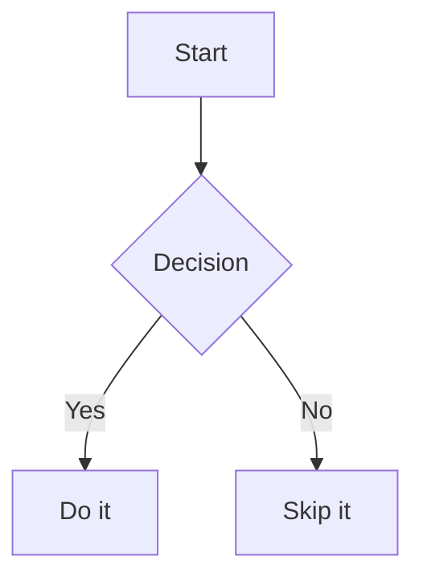

### This is the idea folder.

---

# Mechanics

> *Things that the player can do or interact in his world*

Mechanics

---

# UI

> *Overlays, menus, hints, pop-ups...*

- [ ]

---

# Audio (Sound effects)

> *What will my player want to hear, footsteps, audio storage, link to entities*

- [ ]

---

# Conception (Code-based)

> *The under-the-hood stuff — architecture, systems, tech decisions.*

- [ ]
> <mark>This highlighted text has </mark>
> <kbd>Space</kbd> and <kbd>Left Shift</kbd> was used for the caps.

---

# Stats

> *Numbers, progression, and what the player earns or loses. What and how do these change throughout a run?*

- [ ]

---

# Movement

> *How does the player move through space? What feels good to me and to others?*

- [ Table example ]

| Left | Center | Right |
|:-----|:------:|------:|
| a[^1] |   b   |     c |
| a    |   b    |     c |
| a    |   b    |     c |
| a    |   b    |     c |
| a    |   b    |     c |

[^1]: And here's the source.

---

# Marketing

> *How to earn a following? I need to make myself known. (website, business cards, github thumnbnail, youtube videos)*

This is the start of an idea

> This could be a quote! \
> this could be another line of the quote! \
> keep going lad you're almost there

---

# Graphics

> *Visual art style, extra material properties, depends on GPU power.*

- [ ]

---

# Settings

> *I want it to feel right, feedback equals opinions and need of multiple options.*

- [ ]

---

# Weapons

> *Guns? Melee? Influenced from other games, but it should feel unique.*

- [ ]

---

# Controller

> *FULL keyboard / controller bindings => less annoying to play. Console vs PC? Not based on console release but preferred inputs!*

- [ ]

---

# Testing

> *kill me*

- [ ]

---

# Design

> *Level design, world layout, and spatial storytelling. What art style should make my game pop? It would need to blend with gameplay.*

- [ ]

---

# Story

> *Why does my game exist? Or is it just a boring simulator?*

- [ ]

---

# Narrative

Maybe NES digitalized speech, maybe voice acting (could ask my buddy Eric), maybe silence (more horror)?
> *How my world interacts with the user or his player. Does it even need voice acting? I could do it NES/Undertale style*

- [ ]

---

# Music

I wanna make music so bad for this game, but I'll need to shape it later during development, I don't even know the vibe yet.
> *Where it is needed, am I making it? Which instruments?*

- [ ]

---

# Animation

> *What style, lock fps maybe? Ultra-realistic? The world is full of advanced 3D technologies but yet so many poopy laptop that can't run csgo lowest res.*

- [ ]

---

# Juice

> *What kind of sepcs you need to run this, and how do I apply it during conception?*

- [ ]

---

# Contribution

Sponsors or patreons could lead to money for commissions, REAL artists, not that bombardillo crocodillo shit.
> *How could I benefit from the help of other peeps? How do I let them contribute as much as I can? (Would uphold the following part)*

- [ ]

---

# Website

> *What employers want to see before or during interviews. What displays my progression, my talents and can be shown anywhere.*

- [ ]
