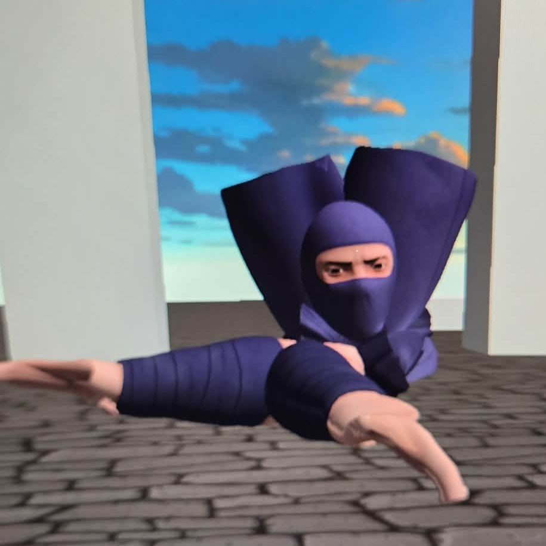
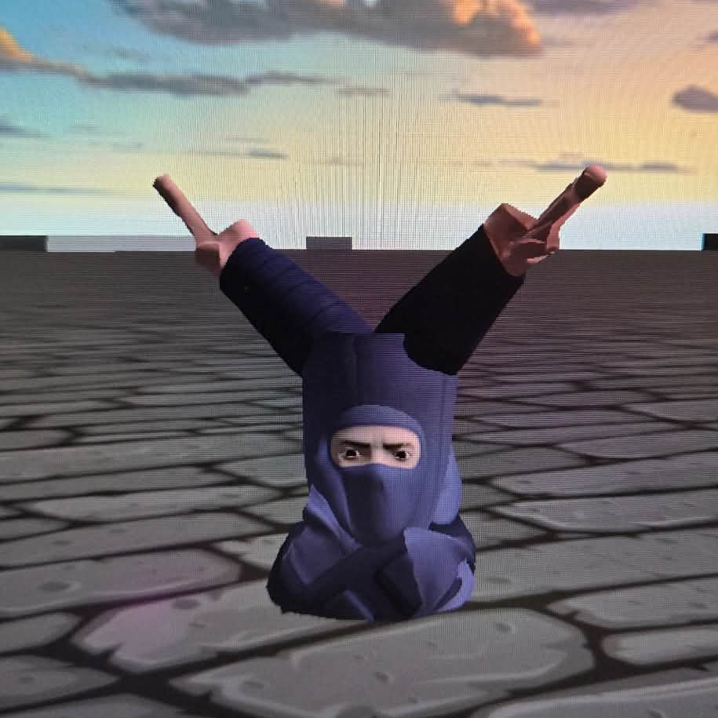
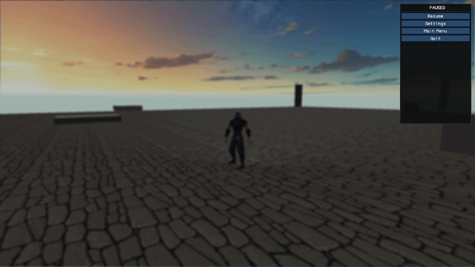

# 3D Zombie Game Project

So far, a C++ 3D graphics engine built from scratch using OpenGL, GLFW, and GLM.
Designed as a foundation for 3D game development with modular architecture
and physics integration. Soon to evolve into a full-scale video game.


---

## Table of Contents

- [Overview](#overview)
- [Features](#features)
- [Development Progress](#development-progress)
- [Project Structure](#project-structure)
- [Setup and Installation](#setup-and-installation)
  - [Prerequisites](#prerequisites)
  - [Library Installation](#library-installation)
  - [Building](#building)
- [Usage](#usage)
- [Architecture](#architecture)
- [Git Workflow](#git-workflow)
- [Roadmap](#roadmap)
- [License](#license)
- [Contact and Support](#contact-and-support)

---

## Overview

This project is (FOR NOW) a custom 3D graphics engine built with **C++17**
and **OpenGL 3.3 (Core Profile)**.
It provides a foundational framework for a potential future game project:
- Real-time 3D rendering with post-processing
- FPS and TPS camera modes with mode-specific movement behaviour
- Player physics (gravity, jumping, sprinting, AABB collision)
- Full ECS (Entity Component System) architecture
- Skeletal animation with crossfade blending
- Scene management with lifecycle hooks
- Persistent settings (resolution, FOV, vsync, audio, etc.)
- Borderless fullscreen, exclusive fullscreen, and windowed display modes

**Target**: A modular, expandable engine suitable for indie game prototyping
and personal analysis / education.

I'm building this engine to grow my understanding of game dev, but also as to start building a portfolio to showcase during
future job applications. I'm working full time while temporarily unemployed for the summer, so for now this is a passion project that
I definitely want to see evolve into something bigger and fun!

Also working on core foundations before developping story or mechanics/concept so the engine can be as reliable as it can. I'm also using
the use of **Claude ai**, **GitHub Copilot** and a little bit of last-resort **ChatGPT** to help me speed up the process of core functions,
kinda like vibe-coding or AI-assisted coding, but with me as anchor for concept choices and code review.

It is also ***VERY IMPORTANT*** to mention my love and appreciation for artists and music composers that share their work through game design,
textures, character models and animations, which I am very limited in doing myself, but might try in the future. Note that 
I officially ***REFUSE*** to use AI to generate art assets or audio files. GUI is not part of this. Might look into commissions for the art in my game,
but I also dabble into music production on my side, so I might try to make some of the music myself.

---

## Features

### Core Systems
- **OpenGL Rendering**: Modern OpenGL 3.3+ with shader support
- **Window Management**: Dedicated `Window` class wrapping GLFW — handles
  display modes, cursor, vsync, size limits
- **Camera System**: FPS freelook and TPS orbit, smooth mouse damping,
  switchable at runtime (F5)
- **Input Management**: Keyboard and mouse input with proper per-frame
  state tracking (just-pressed, held, released)
- **Scene Management**: Pluggable scene architecture with lifecycle hooks
- **Asset Management**: Singleton `AssetManager` for meshes, shaders,
  textures, and audio
- **Settings**: Persistent INI-based settings with in-game apply + revert

### ECS Architecture
- **World**: Central entity registry with typed component storage
- **Components**: Transform, Velocity, Mesh, SkeletalMesh, Material, Collider,
  Physics, Player, CameraBlocker, Vaultable
- **PhysicsSystem**: Gravity, integration, AABB collision, spring arm camera
- **PlayerSystem**: Input-driven movement, mode-aware mesh rotation, landing lock
- **RenderSystem**: World-iterating draw pass, per-entity material/shader support

### Player Mechanics
- **Physics**: Gravity, jumping, coyote time for ledge forgiveness (jump buffering)
- **Movement**: Camera-relative WASD — strafes in FPS, mesh-turns in TPS
- **Sprint**: Shift multiplier (1.5x speed), applies to crouch and prone as well
- **Crouch / Prone**: Toggle with ceiling check, needs better animations
- **Slide**: Call of Duty BO3 style slide-jump that can be chained
- **Vault (quick ledge climbing)**: Proximity and facing detection, choppy and trimmed squat animation
- **Hard Landing**: Impact velocity detection for big jumps, brief movement loss (might remove)


### Animation System
- **Skeletal Mesh**: Bone-weighted vertex skinning via `skinned.vert`
- **Animator**: Per-clip playback with loop/one-shot support, playback speed control
- **Crossfade Blending**: Smooth per-bone slerp/lerp transitions between any two clips
- **Root Motion Stripping**: DOES NOT WORK, therefore needs static animations
- **State-Driven**: Animation selection driven by player state flags each frame
- **Clips loaded**: idle, run, walk\_back, fall, jump, land, slide, prone,
  crouch\_idle, crouch\_walk, vault

PS: HEAVILY RELIES ON FREE MIXAMO ANIMATIONS' BONE STRUCTURES FOR BASIC HUMANOID\
PPS: probably needs rework

### Graphics
- **Post-Processing**: FBO-based render pipeline with blur pass
  (active on pause/settings overlay)
- **Resolution Scaling**: Separate internal render resolution and display
  resolution — works in all window modes (added funny 320×240 res -> beware of windowed low res lol)
- **Aspect Ratio Correction**: Black bars (letterbox/pillarbox) when render
  ratio doesn't match display ratio — no stretching
- **Skybox**: Cubemap skybox rendering
- **Lighting**: Phong lighting with diffuse textures, configurable sun position
- **Primitives**: Built-in cube, square, triangle geometry via `Primitives` namespace

---

## Development Progress

### Week 1: Core Engine & Player Control

**Commits & Milestones:**

#### Phase 1: Engine Foundation
- **Input System**: Implemented `Input` class with GLFW integration
  (handles `GLFW_REPEAT` for held keys)
- **Camera System**: Built `Camera` with freelook (yaw/pitch), mouse
  sensitivity, and smooth damping
- **Scene Management**: Created `SceneManager` and base `Scene` class
  with lifecycle (`onEnter`, `onExit`)

#### Phase 2: Player Physics & Movement
- **Entity Base Class**: Added `Entity` with position, velocity, gravity
  scale, and flying flag
- **Player Class**: Derived from `Entity` with full physics:
  - Gravity integration (`-9.81 m/s²` with configurable scale)
  - Jump impulse and terminal velocity clamping
  - Ground detection and snapping
- **Movement Controller**: Camera-relative horizontal movement
  (WASD flattened to XZ plane)
  - Acceleration/deceleration smoothing
  - Friction-based sliding on input release
  - Sprint multiplier (Shift key)

#### Phase 3: Integration & Polish
- **Input Refactoring**: Replaced per-frame key array with direct
  `Input` queries
- **Micro-optimizations**: `glm::length2()` for zero-checks, cached
  camera trigonometry

**Testing:**
- TODO: Add unit tests for physics calculations and input handling
- TODO: Needs error handling class


---

### Weeks 2–3: Architecture Overhaul

This stretch was originally about adding more functionnality to the engine, but I ended up
completing a checklist given by Claude about refactoring the architecture and ECS part of the engine.
Additionally added a GUI system, some settings with basic camera and graphics options.

#### Visuals and Skybox

- Added a simple skybox with a cubemap shader and texture
- Implemented basic Phong lighting with a directional sun light and diffuse textures


#### Extraction & Separation of Concerns

- **PostProcess** — extracted FBO management and blur pass out of the
  Game god-class. Introduced separate `renderW/H` (internal resolution)
  and `displayW/H` (window/monitor size) to make resolution scaling work
  correctly across all display modes.
- **UIManager** — pulled all ImGui menus (main menu, pause, settings,
  settings-from-pause) out of Game. Uses a `Game&` reference with
  `friend class UIManager` for clean internal access.
- **Window** — dedicated class wrapping all GLFW window calls.
  Game no longer touches GLFW directly for anything window-related.
  Handles fullscreen, borderless, windowed, cursor mode, vsync,
  and size limits.
- **Primitives namespace** — built-in geometry (cube, edges, square,
  triangle) moved out of inline setup code.

#### Borderless Fullscreen
- Added as a third display mode alongside windowed and exclusive fullscreen
- Maintains correct render resolution independently from monitor resolution
- Window positioned using `glfwGetMonitorPos` for multi-monitor support

#### ECS Migration
Replaced the old poopy Entity/Player inheritance hierarchy with a proper
Entity Component System. Note that i added files and folders at the start of the project and barely used them lol. 
Everything that was on the base `Entity` class is now a component; behaviour lives in systems.

- **`components.h`** — all component structs with sensible defaults
- **`World`** — entity lifetime management + typed component storage
  via static maps. `view<T>()` for single-component queries,
  `view<A,B>()` for two-component queries
- **`PhysicsSystem`** — fully ported to `World&`. Gravity, integration,
  AABB collision and resolution, spring arm all use components
- **`PlayerSystem`** — input-to-movement logic extracted from the old
  `Player::handleInput` into a standalone system
- **`RenderSystem`** — iterates the world, resolves per-entity shader
  and material, calls `Renderer` for each visible entity
- Deleted: `Entity` class, `Player` class, `entities` vector on Scene

#### Bugs Fixed This Stretch
- Borderless fullscreen rendering at quarter resolution on startup
- Window not centered on primary monitor in borderless mode
- Resolution downscaling locking window to a fixed smaller size
- Light uniforms being redundantly set per-entity instead of once per frame
- Settings confirm overlay flickering (re-spawned every frame)
- `glad.h` double-include conflict in UIManager

Important but I changed Visual Studio C++ versions, from C++14 to C++17 for more features.

---

### Week 4: Animation System, Player Polish, and Display Improvements

I started this week a bit late, I had to finish the last two week's README update and some big refactoring.
This week was mostly based around an animation loading system. Though i finished that pretty quickly and moved on
to player movement mechanics. My friends couldn't see my game through screen share, OBS didn't work either, so I had to
fix this or else I wouldn't be able to show the atrocities my animation system created.\
\


\
\
I heavily relied on Mixamo for free animations, only problem being the vertical movement for jumping or climbing... BUT IT WILL DO...
\
Also had to polish the display settings because borderless wasn't showing right render res, and menus were buggy.


#### Skeletal Animation System

Built a complete skeletal animation pipeline using **Assimp** for FBX loading:

- **`SkeletalLoader`** — parses FBX files into `Skeleton` (bone hierarchy + node tree)
  and `AnimationClip` (per-bone keyframe channels with position, rotation, scale)
- **`Animator`** — drives clip playback: advances time, evaluates keyframes via
  linear interpolation (positions/scales) and slerp (rotations), outputs a
  `boneMatrices[]` array uploaded to the skinned shader each frame
- **`SkeletalMesh`** — stores skinned vertex data (positions, normals, UVs,
  bone indices, bone weights), drawn with `skinned.vert` / `skinned.frag`
- **`SkeletalMeshComponent`** — ECS component holding mesh + animator pointers,
  visibility flag; rendered in `GameScene::render()` alongside static meshes

#### Crossfade Blending

Instead of hard-cutting between clips, transitions blend per-bone pose data:

- `crossFadeTo(name, duration, loop)` — saves previous clip + current time,
  starts new clip from 0, advances a `blendFactor` (0→1) over `duration` seconds
- `processNode()` samples both clips and `glm::mix` / `glm::slerp` the results
  by `blendFactor` — smooth transition on every bone simultaneously
- `isFinished()` — returns true when a non-looping clip has played through

#### Animation State Machine

Player animation is driven by state flags read from `PhysicsComponent` and
`PlayerComponent` each frame in `Game::update()`:

| State | Clip | Notes |
|---|---|---|
| Vaulting | `vault` | One-shot, speed scaled to vault duration |
| Just landed (hard) | `land` | One-shot, freezes input for half a second |
| Airborne (jumping) | `jump` → `fall` | Jump plays while ascending + space held; falls back at summit or release |
| Airborne (falling) | `fall` | Mid-air state |
| Sliding | `slide` | Needs proper animation (STATIC) |
| Prone | `prone` | Speed = 0 when still |
| Crouching + moving | `crouch_walk` | Speed scaled to crouch move speed |
| Crouching + still | `crouch_idle` | — |
| Running backward (FPS) | `walk_back` | Only in FPS mode |
| Running | `run` | Speed scaled to move speed |
| Idle | `idle` | — |



#### Player Mechanics (Beginning)

- **FPS vs TPS movement**: In FPS mode, mesh always faces camera direction —
  WASD strafes, only mouse turns. In TPS, mesh rotates to face movement direction.
  Walk-back animation only triggers in FPS mode (TPS just turns and runs).
- **Hard landing lock**: Impact velocity on landing determines whether a landing
  animation plays and movement is briefly locked (`landingLockTimer`)
- **Coyote time + jump buffer**: Already in the engine, now properly integrated
  with the animation system (no jump anim on ledge-falls)
- **SkeletalMeshComponent visibility**: Toggled correctly when switching
  between FPS and TPS camera modes


#### Display & Resolution Improvements

- **Fullscreen now uses native display size**: Renders at selected resolution,
  blits to monitor native — same as borderless. Low res = pixelated upscale.
- **Aspect ratio-correct blit**: `PostProcess::blit()` calculates a
  letterbox/pillarbox viewport when render ratio ≠ display ratio. Black bars
  instead of stretching.
- **FontGlobalScale tied to display size**: Menus scale to actual display
  resolution, not render resolution
- **7 resolutions**: Added 320×240 (4:3 retro)


---

## Project Structure

```
3D_GLFW_FIRST/
├── include/
│   ├── animation/
│   │   ├── animation.h           # AnimationClip, BoneChannel, keyframe structs
│   │   ├── animator.h            # Clip playback, crossfade blending, bone matrices
│   │   ├── skeletal_loader.h     # FBX → Skeleton + AnimationClip via Assimp
│   │   └── skeleton.h            # Bone and Node hierarchy structs
│   ├── core/					  
│   │   ├── game.h                # Main game loop and state
│   │   ├── window.h              # GLFW window wrapper
│   │   ├── input.h               # Input state management
│   │   ├── asset_manager.h       # Mesh/shader/texture/audio registry
│   │   ├── settings.h            # Persistent settings
│   │   └── ui_manager.h          # ImGui menu rendering
│   ├── rendering/				  
│   │   ├── camera.h              # FPS and TPS camera
│   │   ├── shader.h              # Shader compilation & uniforms
│   │   ├── renderer.h            # Per-entity draw calls
│   │   ├── render_system.h       # ECS world render pass
│   │   ├── mesh.h                # Mesh data & draw calls
│   │   ├── skeletal_mesh.h       # Skinned mesh data & draw calls
│   │   ├── material.h            # Material struct (diffuse, color, shininess)
│   │   ├── texture.h             # Texture loading & binding
│   │   ├── skybox.h              # Cubemap skybox
│   │   ├── post_process.h        # FBO, blur, resolution scaling, aspect ratio blit
│   │   └── primitives.h          # Built-in geometry
│   ├── scenes/					  
│   │   ├── scene.h               # Scene base class (owns World)
│   │   ├── scenemanager.h        # Scene lifecycle management
│   │   └── gamescene.h           # Main game scene
│   ├── physics/				  
│   │   └── physics_system.h      # Gravity, AABB, spring arm
│   └── ecs/					  
│       ├── components.h          # All component types
│       ├── world.h               # Entity registry + component storage
│       └── player_system.h       # Player input system
├── src/
│   ├── animation/
│   │   ├── animator.cpp
│   │   └── skeletal_loader.cpp
│   ├── core/
│   │   ├── game.cpp
│   │   ├── window.cpp
│   │   ├── input.cpp
│   │   ├── asset_manager.cpp
│   │   ├── settings.cpp
│   │   └── ui_manager.cpp
│   ├── rendering/
│   │   ├── camera.cpp
│   │   ├── shader.cpp
│   │   ├── renderer.cpp
│   │   ├── render_system.cpp
│   │   ├── mesh.cpp
│   │   ├── skeletal_mesh.cpp
│   │   ├── texture.cpp
│   │   ├── skybox.cpp
│   │   ├── post_process.cpp
│   │   └── primitives.cpp
│   ├── scenes/
│   │   ├── scenemanager.cpp
│   │   └── gamescene.cpp
│   ├── physics/
│   │   └── physics_system.cpp
│   ├── ecs/
│   │   ├── components.cpp
│   │   ├── world.cpp
│   │   └── player_system.cpp
│   └── main.cpp
├── shaders/
│   ├── basic.vert / basic.frag     # Phong lighting shader
│   ├── skinned.vert / skinned.frag # Bone-weighted skeletal shader
│   ├── skybox.vert / skybox.frag
│   └── blur.vert / blur.frag       # Post-process blur
├── assets/
│   ├── animations/                 # FBX files (Ninja model + clips)
│   ├── textures/
│   ├── skyboxes/
│   ├── levels/
│   └── audio/
├── README.md
├── settings.ini                   # game config file
└── imgui.ini                      # ImGui config file
```

---

## Setup and Installation

### Prerequisites

- **Visual Studio 2022** (or compatible C++17 compiler)
- **Git**
- Windows 10/11 (x64)
- GLFW3 and GLM (see below — all other libraries are vendored in `libs/`)

### Library Installation

#### 1. GLFW3 (Window & Input)
Download precompiled GLFW from https://www.glfw.org/download.html  
Extract to a known location, e.g., `C:\Libraries\GLFW`

In Visual Studio Project Properties:
- VC++ Directories > Include Directories: Add `C:\Libraries\GLFW\include`
- VC++ Directories > Library Directories: Add `C:\Libraries\GLFW\lib-vc2022`
- Linker > Input > Additional Dependencies: Add `glfw3.lib`
- Copy `glfw3.dll` to your Debug/Release folders

#### 2. GLM (Math Library)
Clone or download from https://github.com/g-truc/glm  
GLM is header-only — just add its root to Include Directories.

#### 3. Assimp (Model/Animation Loading)
Used for loading FBX skeletal models and animation clips.  
Download precompiled binaries from https://github.com/assimp/assimp/releases  
or build from source. Add include/lib paths and link `assimp-vc143-mt.lib`.

#### 4. Vendored Libraries (already in `libs/`, no install needed)

| Library | Version/Notes | Purpose |
|---|---|---|
| **GLAD** | OpenGL 3.3 Core | OpenGL function loader |
| **ImGui** | Bundled in `libs/imgui/` | In-game UI and menus |
| **tinyobjloader** | `libs/tiny_obj_loader.h` | `.obj` mesh loading |
| **stb_image** | `libs/stb_image.h` | Texture loading (PNG, JPG, etc.) |
| **miniaudio** | `libs/miniaudio.h` | Audio playback (single-header) |

These are already part of the repository — just build and go.  
For GLAD specifically, make sure `glad.c` is included as a source file in
your project.

### Building

```bash
git clone https://github.com/TomBlob/GLFW_GAME.git
cd GLFW_GAME
# Open 3D_GLFW_FIRST.sln in Visual Studio
# Build > Build Solution (Ctrl+Shift+B)
# Debug > Start Debugging (F5)
```

## Usage

### Controls

| Input | Action |
|-------|--------|
| **W / A / S / D** | Move forward/left/backward/right |
| **Space** | Jump (hold for higher jump) / Vault when near object / Get up from crouch & prone |
| **Left Shift** | Sprint (1.5x speed) |
| **C** | Crouch (hold C while airborne + land to slide with enough speed) |
| **Left Ctrl** | Prone |
| **Mouse** | Look around (pitch/yaw) |
| **F5** | Toggle First-person / Third-person camera |
| **Esc** | Pause / Back in a menu |

---

## Architecture

### ECS (Entity Component System)

The engine uses a lightweight ECS where data lives in components and
behaviour lives in systems. There are no virtual `update()` calls on
entities — systems iterate the World and operate on whichever components
they care about.

**World** — central registry. Creates/destroys entities, stores components
in static typed maps, provides `view<T>()` queries.

**Components**: `TransformComponent`, `VelocityComponent`, `MeshComponent`,
`SkeletalMeshComponent`, `MaterialComponent`, `ColliderComponent`,
`PhysicsComponent`, `PlayerComponent`, `CameraBlockerComponent`, `VaultableComponent`

**Systems**: `PhysicsSystem`, `PlayerSystem`, `RenderSystem`

### Animation Pipeline

1. `SkeletalLoader` parses FBX via Assimp into `Skeleton` + `AnimationClip` data
2. `Animator` advances clip time each frame, evaluates keyframes, outputs `boneMatrices[]`
3. `skinned.vert` reads `boneMatrices[]` and blends vertex positions/normals by weight
4. Crossfade: `crossFadeTo()` blends two clips simultaneously per bone using slerp/lerp
5. State machine in `Game::update()` selects which clip to play based on player flags

### Scene Management

**SceneManager** — registers and loads scenes by name, manages lifecycle
(`onEnter` → `onExit`), injects shared systems (physics, renderer).

**Scene** — base class that owns a `World`. Derived scenes implement
`update()`, `render()`, and `onEnter/onExit`.

### Camera System

- **FirstPersonCamera**: standard yaw/pitch freelook. Mesh faces camera direction,
  WASD strafes relative to look direction.
- **ThirdPersonCamera**: orbits a target with spring arm collision
  (pushes camera in when geometry blocks the view). Mesh rotates to face movement.
- Both share smooth mouse damping and configurable sensitivity/FOV

### Rendering Pipeline

1. `PostProcess::bindForRender()` — bind FBO, set render viewport
2. `GameScene::render()` — set light uniforms, call `RenderSystem` (static meshes)
3. `RenderSystem` — iterate world entities, call `Renderer` per entity
4. Skeletal mesh pass — iterate `SkeletalMeshComponent` entities, upload bone matrices, draw
5. Skybox pass
6. `PostProcess::blit()` — unbind FBO, calculate aspect-ratio viewport, run blur shader, draw quad

---

## Git Workflow

### Branch Strategy

```
master          (stable, production-ready)
↑
dev             (integration branch for features)
↑
feat-XYZ        (feature branches, created from dev)
```

### Line Endings

Sometimes doesn't work? (still the case)

```
git config --global core.autocrlf true
```

---

## Roadmap

### Done
- Core rendering pipeline (meshes, shaders, lighting)
- FPS and TPS cameras with spring arm
- Player physics and movement (ECS-based)
- AABB collision detection and resolution
- Post-processing FBO with blur
- Full ECS architecture (World, components, systems)
- Persistent settings (INI)
- ImGui menus (main menu, pause, settings)
- Borderless fullscreen + resolution scaling
- AssetManager, Window class, UIManager, PostProcess
- Crouch, prone, slide, vault player mechanics
- Full skeletal animation system with crossfade blending
- Animation state machine (idle, run, jump, fall, land, vault, slide, prone, crouch)
- FPS/TPS mode-aware movement and mesh rotation
- Hard landing detection and movement lock
- Aspect ratio-correct blit with black bars
- `applySettings()` as single source of truth for display changes

### Upcoming
- [ ] Website and documentation setup through NameCheap hosting
- [ ] More scene content / level design (new meshes)
- [ ] Additional post-process effects (lighting fixes)
- [ ] Proper error/logging system
- [ ] Unit tests
- [ ] Strafe animations (left/right)
- [ ] Idle-to-crouch / Idle-to-prone transition animation

---

## License
© 2026 Thomas Primeau. All rights reserved. See [LICENSE](./LICENSE) for details.

---

## Contact and Support

- **GitHub**: [TomBlob](https://github.com/TomBlob)
- **Repository**: [GLFW_GAME](https://github.com/TomBlob/GLFW_GAME)
- **Email**: Please send any inquiries or feedback to [tom@tomblob.dev](mailto:tom@tomblob.dev)

---

**Last Updated**: May 31st 2026 | **Current Version**: 0.4.1 (Week 4 — Animation System, Player Polish, and Display Improvements)